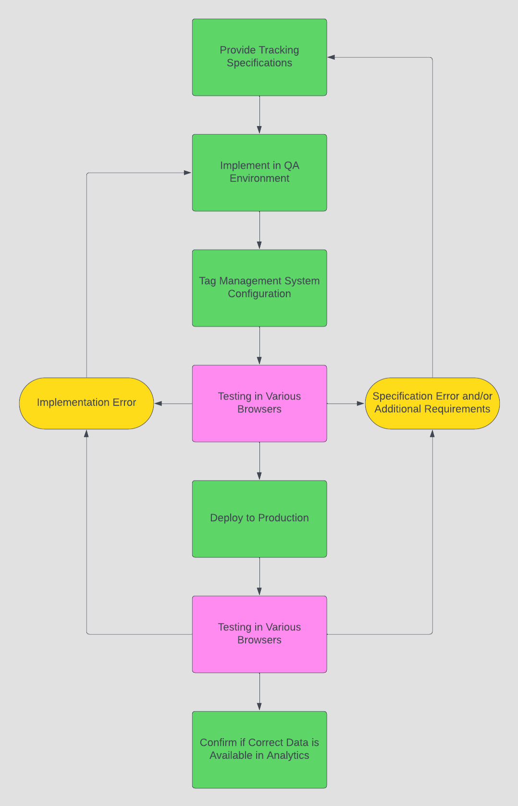
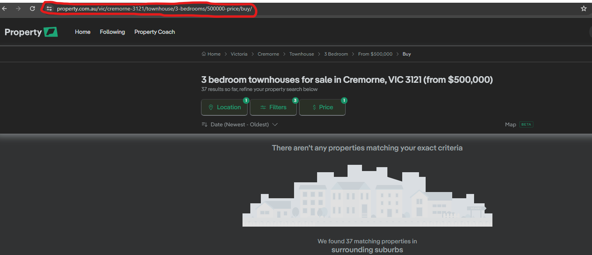

# Devin Jayasinghe 
# REA Group - Digital Analytics Specialist Technical Interview Task Report

The purpose of this document is to provide answers and thoughts on the pre-interview tasks provided by REA Group.

# Task 1
**Approach:**

**Data Tracking Implementation:**

1. **Identify Key Metrics:** 
   - Determine the key metrics to track for analytics such as page views, visits, session duration, bounce rate, conversion rate.
   - For personalisation teams, track user behavior like property searches, interactions with site features.
   - Fire success event for user who completed search (event5 = performedSearch), grab keywork from query string parameter to an eVAR
   - Page Tracking based on URL (page name, site, site section, site sub-section)


Example Data Structure:


```python
 {
    "pageName": "realestate:advice:selling",
    "site": "realestate",
    "site_section": "advice",
    "site_sub_section": "advice:selling",

    "article_title": "4-things-not-to-do-when-selling-your-home",
    "author": "evan-black",
    "publishDate": "29-10-2020",
    "videoPage": "true",
    "categories": [
        "selling",
        "seller-research"
    ],
}
;
```


    ''


5. **Campaign Tracking:**
   - Marketing teams need to make sure they are using specific campaign tracking codes. (Adobe Analytics ?cid=dis|amd|sel)
   - Marketing teams can use the excel marketing campaign code generator.
   - We need to make sure the campaign query string parameter is captured (Adobe Analytics = tracking code), also capture in seperate eVAR as well.
   - Create set of Adobe Analytics classification rules to decipher the tracking code.
   - This would facilitate answering if a user came from email and then performed a conversion event such as completing a search.  

7. **Data Security and Compliance:**
   - Ensure compliance with data protection regulations.
   - Implement measures to safeguard sensitive user information and anonymize personally identifiable data.

# Task 2
**Workflow for QA, Testing, and Validation Process:**

Here's a simplified visual representation of the workflow:




# Task 3



Example Data Structure:


```python
 {
    "pageName": "property:vic:buy",
    "site": "property",
    "site_section": "buy",
    "location": "cremorne-vic-3121",
    "propertyType": "townhouse",
    "marketStatus": "for-sale",
    "bedroomsMin": 3,
    "bathroomsMin": 0,
    "priceMin": 500000,
	"priceMax": 0,
	"landMin": 0,
	"indoorFeatures": "any",
	"outdoorFeatures": "any",
	"ecoFriendlyFeatures": "any",
	"carSpacesMin": "any",
	"keywords": [],
}
;
```


    ''


Chat GPT Answer:


```python
{
  "pageType": "propertyListing",
  "propertyDetails": {
    "location": "Cremorne, Victoria, 3121",
    "propertyType": "Townhouse",
    "bedrooms": 3,
    "priceRange": "Up to £500,000",
    "buyOrRent": "buy"
  },
  "userInteractions": {
    "viewedProperties": [
      {
        "propertyID": "unique_property_id",
        "location": "Cremorne, Victoria, 3121",
        "propertyType": "Townhouse",
        "bedrooms": 3,
        "price": 500000
      }
    ],
    "searchCriteria": {
      "location": "Cremorne, Victoria, 3121",
      "propertyType": "Townhouse",
      "bedrooms": 3,
      "maxPrice": 500000,
      "buyOrRent": "buy"
    }
  }
}
;
```


    ''


